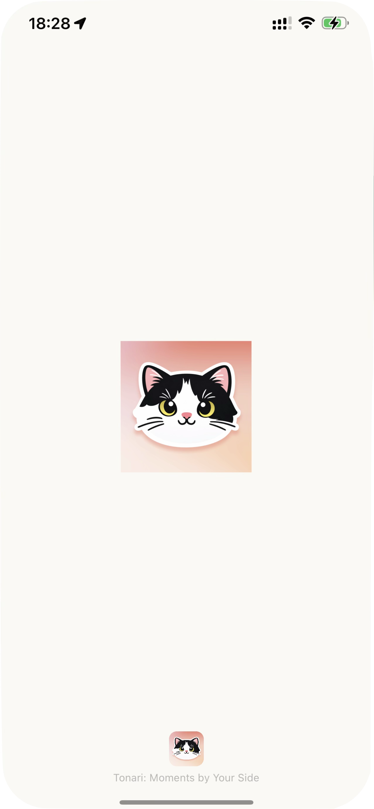

# expo-splash-screen-ios-brand

`expo-splash-screen-ios-brand` is an Expo config plugin that appends a bottom icon + slogan block to the iOS `SplashScreen.storyboard` generated by `expo-splash-screen`, while keeping Expo's centered splash image intact.

## Install

```bash
bun add expo-splash-screen-ios-brand
```

If you want to consume the package directly from Git instead of npm, use:

```bash
bun add https://github.com/jyuuroku16/expo-splash-screen-ios-brand
```

## app.config.ts

```ts
import { ConfigContext, ExpoConfig } from "expo/config";

export default ({ config }: ConfigContext): ExpoConfig => ({
  ...config,
  plugins: [
    [
      "expo-splash-screen",
      {
        image: "./assets/images/splash-icon.png",
        imageWidth: 150,
        resizeMode: "contain",
        backgroundColor: "#faf9f5",
        dark: {
          backgroundColor: "#1A1625",
        },
      },
    ],
    [
      "expo-splash-screen-ios-brand",
      {
        icon: "./assets/images/splash-screen-icon.png",
        slogan: "Tonari: Moments by Your Side",
        iconWidth: 40,
        sloganFontSize: 12,
        sloganColor: "#b8b8b8",
        spacing: 6,
      },
    ],
  ],
});
```

## Options

| Option | Required | Default | Description |
| --- | --- | --- | --- |
| `icon` | Yes | - | Brand icon asset copied into `Images.xcassets` |
| `slogan` | Yes | - | Bottom line of text shown under the icon |
| `iconWidth` | No | `40` | Icon width in points |
| `iconHeight` | No | `iconWidth` | Icon height in points |
| `sloganFontSize` | No | `14` | Slogan font size in points |
| `sloganColor` | No | `#b8b8b8` | 6-digit hex color for the slogan text |
| `spacing` | No | `12` | Vertical gap between the icon and slogan |
| `horizontalPadding` | No | `32` | Safe-area padding for the slogan label |

## Screenshot


